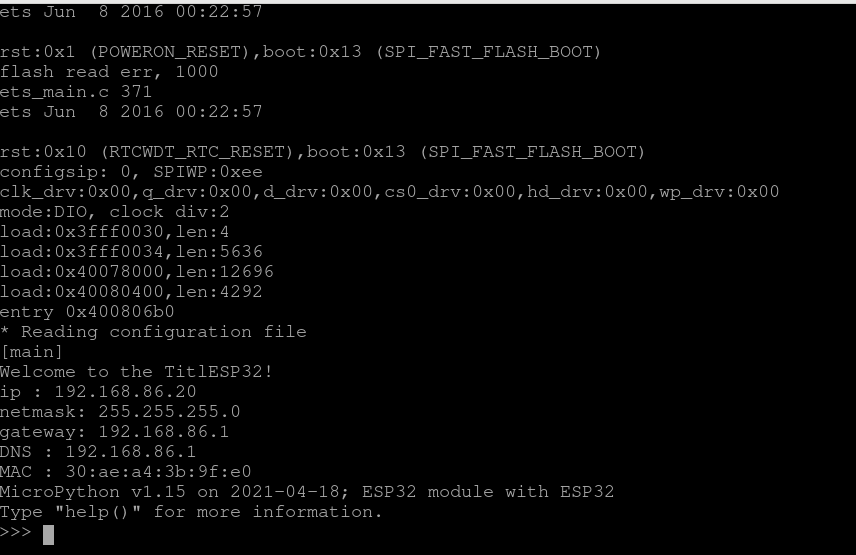

# TitlESP32
ESP32 MicroPython application to read and log data from a Tilt™ Hydrometer.

## Requirements
* A board with an ESP32 chip
* USB cable - USB A / micro USB B
* Computer running Windows, Linux, or macOS
* [Python 3.x](http://www.python.org/)
* [Ampy](https://github.com/scientifichackers/ampy) - check the [Install ampy](https://learn.adafruit.com/micropython-basics-load-files-and-run-code/install-ampy) section of the [MicroPython Basics: Load Files & Run Code](https://learn.adafruit.com/micropython-basics-load-files-and-run-code) tutorial for more details

## TiltESP32 installation guide

**Attention**: At this moment, this is a work in progress project and there is no working code to read data from a Tilt hydrometer yet. This setup will make your ESP32 able to connect to your WiFi network and be ready for the upcoming project updates.

Please joing the [announce list](https://groups.google.com/g/tiltesp32-announce) to receive updates about the project.

### Preparing the board

* Follow the steps in [Getting started with MicroPython on the ESP32](http://docs.micropython.org/en/v1.15/esp32/tutorial/intro.html#getting-started-with-micropython-on-the-esp32).
  * This application has been designed and tested using the [Firmware for Generic ESP32 module](https://micropython.org/download/esp32/) with the most recent **GENERIC** stable v1.15 firmware built with ESP-IDF v4.x.
* Make sure your firmware is working by connecting to the [REPL (Read Evaluate Print Loop) over the serial board](http://docs.micropython.org/en/v1.15/esp8266/tutorial/repl.html#repl-over-the-serial-port)

### Configuration and deploy

* Modify the `config.json` file to reflect your WiFi network information.
* Connect your ESP32 board.
* Upload the project files:
  * `ampy --port /dev/ttyUSB0 put boot.py`
  * `ampy --port /dev/ttyUSB0 put main.py`
  * `ampy --port /dev/ttyUSB0 put config.json`
* Reboot your board.

### Find your device

The default hostname is `tiltesp32` (you can change it in `config.json`), and you will be able to find the device using any tool you prefer to scan your WiFi network.

Also, you can connect the board to your computer USB port, and using the a serial monitor software, read the initialization output to get the IP address. See the screenshot below how it displayed:

